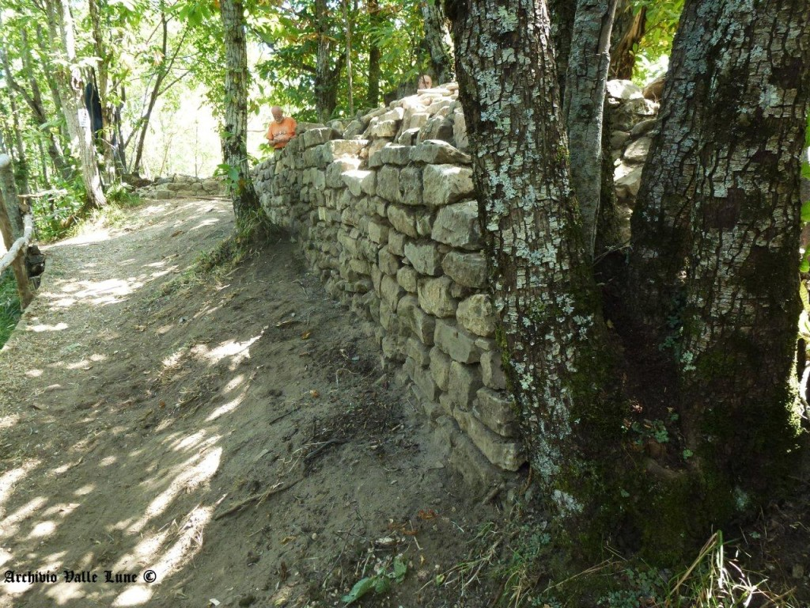

## APPennino
Un’applicazione per l’escursionismo

### APPennino è un’applicazione destinata agli escursionisti. 

Racconta il territorio della Montagna pistoiese nella sua affascinante complessità, fatta di elementi naturali, storico-archeologici e folclorici.
In questa prima fase, è proposto un percorso attraverso la valle del torrente Verdiana che conduce fino al sito archeologico di Castel di Mura (Lancisa), fortezza del comune di Pistoia nel Trecento, costruita in un castello già esistente lungo un’antica via che univa Pistoia a Modena, la via Romea-Nonantolana.
Il percorso è facile, adatto anche a famiglie con bambini. Le indicazioni fornite dall’applicazione invitano a osservare le piante, le rocce, le antiche costruzioni presenti lungo il sentiero o osservabili in lontananza. Suggeriscono un’immersione nel paesaggio della montagna alla scoperta dell’incessante dialogo tra gli esseri umani e la natura.
Il progetto è stato realizzato da tre associazioni di volontariato, Valle Lune, Gruppo Naturalistico Appennino Pistoiese, Associazione Museo della Gente dell’Appennino, che operano nel territorio della Montagna pistoiese e si occupano di ricerca e divulgazione rispettivamente in ambito storico-archeologico, naturalistico e folclorico.
APPennino è stato premiato da Cesvot (Centro Servizi Volontariato Toscana) nell’ambito del bando Il volontariato per la comunità 2017 finanziato con il contributo di Regione Toscana-Giovanisì, 
in accordo con il Dipartimento della Gioventù e del Servizio Civile Nazionale.

*Crediti del progetto* 

Appennino è un progetto di Valle Lune associazione di volontariato, Gruppo Naturalistico Appennino Pistoiese, Associazione Museo della Gente dell’Appennino, realizzato con la collaborazione di 

Cristina Taddei, archeologa, ricercatrice indipendente
Simone Vergari, naturalista, Gruppo Naturalistico Appennino Pistoiese
Alfonso Crisci, biometeorologo( IBIMET CNR Istituto di Biometeorologia di Firenze)